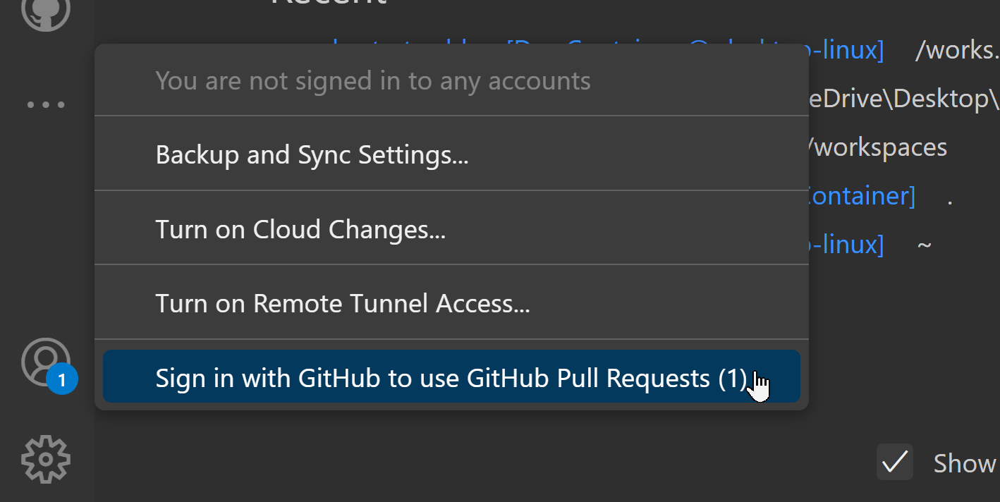

# A starter portfolo-blog website for UA SDS GIDP Students

All students in the University of Arizona Statistics and Data Science GIDP are required to "Prepare a basic web page containing information on their own research, teaching, and other professional activities".

[Communications Requirements](https://stat.arizona.edu/communications-skills-requirement)

This is intended to help with that!

Over the Summer of 2024 I spent some time researching how to build a personalized professional site that was free, easy enough to build and maintain, and gave me a flexible enough framework to post my work with some nice bells and whistles. My main requirements for the site would be the ability to use markdown to write posts, and that it have the ability to render $\LaTeX$.

Without going into too much detail about trial and error, I landed on a starter template that met these criteria (and as it turns out, quite a bit more).

### [Tailwind Nextjs Theme](https://https://github.com/timlrx/tailwind-nextjs-starter-blog.alexsalce.com)

There are a bunch of templates available out there, but for the purposes we are after, this is the best one that I found to use as a starting point.

I recommend going through the `README` on this repo to get a detailed overview and lots of other cool examples.
This template utilizes the [Next.js](https://nextjs.org/) framework created by [Vercel](https://vercel.com/) that is built from the [React](https://react.dev/) framework.

> ⚡**FAIR WARNING**⚡
> You're going to have to learn some full-stack web dev! I promise it's not bad though!

I do recommend taking some time to better understand [the framework](https://www.youtube.com/watch?v=Sklc_fQBmcs), it's cool and very useful for what we'll be doing. In short, this framework helps us to build a web application that functions as a website, so you may see me refer to this as a "web app".

Through plenty of trial and error, I was able to eventually transform the template into my personal site, you can have a look at it here:

### [Alex Salce's website](https://www.alexsalce.com)

This is, of course, just an example of how your site could look. Using this framework is great because it is very customizable!

> 🚨**ADDITIONAL DISCLAIMER**🚨
> I am not an expert in any of this! Nor have I had any really formal training in web development. This process is only based on my personal trial an error self-taught experience, and there may be better ways to do some of these things. What I _can_ say for sure is that this gets the job done, but if you see any better ways to do any of this, please do so _and_ it would be of great help to me and anyone else using this to get YOUR feedback! So please feel free to interject and provide any suggestions/comments/concerns!

# Setting up the site

Let's jump right into it! First, there are a few prerequisites. To follow along this tutorial you will need the following:

- Make sure [Git](https://git-scm.com/downloads) is installed on your machine
- A [Github](https://github.com/) account
  - You'll need to be logged in
- A [Vercel](https://vercel.com/) account
  - You'll also need to be logged in here
- [VSCode](https://code.visualstudio.com/download) installed on your machine
  - I will be using VSCode in this tutorial. If you have another preferred IDE I will assume you know enough to follow along!
  - VSCode has a ton of nice features and components available to help you code, and makes your Github maintenance a piece of cake
- [Docker](https://www.docker.com/products/docker-desktop/)
  - Specifically, please install Docker Desktop
  - We will be running our development environment from a **[container](https://www.docker.com/resources/what-container/)**. If you have not done this before, don't worry! The steps in this tutorial will help you get it set up
  - _Side note!_ Containers are super useful and worth your time learning how to use for any of your development projects

### Launch Docker Desktop

Once the above is complete, open Docker Desktop and make sure that it is running before you proceed. This will allow us to create our development container, and the app provides a nice way to manage of all of your containers.

> ⚠️**NOTE**⚠️
> You will need Docker running any time you open your development project!

### Launch VSCode

Go ahead and open up VSCode.
First, we are going to need to install some extensions.

Download the `Dev Containers` and `Docker` extensions.
+ 

> ⚠️**NOTE**⚠️
> These extension installations are *local*, so they are available to all projects that you open in the future. When we create a container, we can also install extensions inside of the container so that they remain tied only to the project itself. There are many other useful extensions available, and it's worth being cognizant of what should be installed locally versus in your project's container.

You can optionally download these at this time. Keep in mind these are *local* extensions installations.

 + 

Once we clone our project into a container, we'll check back in on the extension. The container config file specifies a few useful extensions to automatically install inside of the container.

### Create new repo

Let's navigate to the template repo. Theoretically you are already here but to follow along you'll probably want to open this link in a new window or tab...

#### [Template Repo](https://github.com/alexsalce/ua-sds-starter-blog)

We want to create a new repo from this template. Do so by clicking `Use this template` and selecting `Create a new repository`

 

 Next, you will choose a name for your repo and add a description if you'd like. By the way, your repo name will not have any impact on your domain name, that's separate.

  

> ⚠️**NOTE**⚠️
>  You can also choose whether you want this repo to be Public or Private. I would advise to set yours to private, but it's up to you. We will not be using Github Pages (which requires a Public repo), rather we will be using Vercel to deploy, which can still deploy the web application from a Private repo (we have to link our Vercel account to Github either way).

Once you are ready, click `Create repository`, and wait until you see that your new repo has been created.

### VSCode: Clone Repository in Container Volume

Let's move back over to VSCode.

#### Sign into Github

First, we need to be sure we are signed into our Github account on VSCode. In VSCode, click on the silhouette avatar in the bottom left corner. It should have a badge with a `1` on it.  

  

It should bring up your browser to sign in, and just follow the prompts until you are signed into Github on VSCode.

> ⚠️**NOTE**⚠️
> Here's an example of "I know there is a better way to do this but this works" for me, so if you know an easier way to sign in let me know! Truthfully, for what we are doing you will inevitably get a prompt to sign into Github.

### Clone Repo into a VSCode project
Once we are signed into Github, we can clone our repo in a container on our machine using VSCode.

Use `F1` on your keyboard to pull up `Show all commands`, which is essentially just a search bar for built-in commands for VSCode. Type in `Dev Containers: Clone Repository in Container Volume` and click when you see it.

  

Once you click, you should see `Clone a repository from Github in a Container Volume`, click, then a list of your Github repos should present itself. Find the repo we just made, click, and when `main` pops up, click again. 

You're off to the races!

This part may take a while.  If you are curious what is chugging in the background, you should get prompted to open the terminal to monitor the installation.

> 🚨**WARNING**🚨
> I have encountered some issues in VSCode with user credential authentication when running the cloning operation. Please follow the instructions at [this Stack Overflow post](https://stackoverflow.com/questions/68775869/message-support-for-password-authentication-was-removed) to generate a Github token that is used in place of your password instead of your normal Github login password. Be sure to store it in whatever password manager your operating system uses in order to not have to re-enter it whenever you are running any actions that use the Github API (which you will be doing quite a bit).

### Verifying everything is working

Once your container volume is fully built, the web app is configured to automatically run `yarn dev` to start running your `▲ Next.js` app in your container. You'll see something like this in your terminal.

  

This will by default attempt to run the app locally using port `3000`, and you can run the site in development mode by navigating to `http://localhost:3000` in a browser on your machine locally.

If you navigate to `http://localhost:3000` and are able to see this:

  

Then congratulations! You are ready to start developing your site!

# Developing your site

We are going to switch over to a blog post now.  Scroll down on the landing page to the `Latest` section and find the post entitled `UA SDS Blog Development & Maintenance`.

 

If you are having issues check these steps. To make sure your `dev` server is running, and use your favorite browser to navigate to the `localhost` port that the server is running on. You should be able to see the `http` port link under your `yarn dev` command output, it looks like this:

If for some reason you can't find it, check the `PORTS` tab, and if it's running you should see it here, and you can right-click>`Open in Browser`

If you don't see a port running here, go back to your `TERMINAL` tabl and run the `yarn dev` command, and it should start.